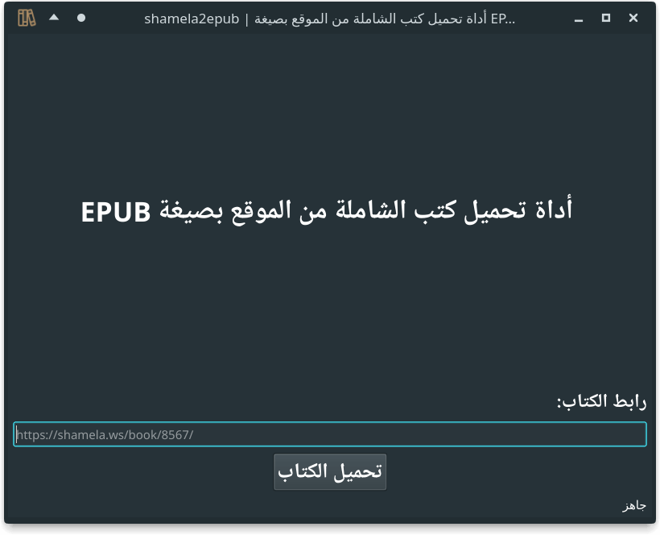

# shamela2epub

> A CLI and GUI tool to download a book on https://shamela.ws into an EPUB book.


[](https://pypi.org/project/shamela2epub/)
[)](https://pepy.tech/project/shamela2epub)

[](https://github.com/yshalsager/shamela2epub/releases/)
[](https://github.com/yshalsager/shamela2epub/releases/latest)

[](https://www.python.org/)
[](https://github.com/ellerbrock/open-source-badges/)

[](https://www.paypal.me/yshalsager)
[](https://liberapay.com/yshalsager)

**Disclaimer:**

*   This software is freeware and open source and is only intended for personal or educational use.

## Installation

### From PyPI

```bash
pip install shamela2epub
```

### From the cloned repository

```bash
# Using poetry
poetry install

# or using pip 18+
pip install .
```

## Usage

### Command-line Tool (CLI)

```bash
python3 -m shamela2epub download URL
# python3 -m shamela2epub download "https://shamela.ws/book/823"

python3 -m shamela2epub download --help
Usage: python -m shamela2epub download [OPTIONS] URL

  Download Shamela book form URL to ePub

Options:
  -o, --output TEXT  ePub output book custom name
  --help             Show this message and exit.
```

### Graphical User Interface (GUI)



*   If you installed the package from PyPI, you can use the following command:

```bash
shamela2epubgui
```

*   If you downloaded the latest gui exe file from releases you can open it normally and use it.
*   Otherwise, use normal python command:

```bash
python3 -m shamela2epub gui
```

## Features

*   CLI and GUI!
*   Creates an [EPUB3](https://www.w3.org/publishing/epub3/epub-spec.html) RTL standard book.
*   Automatically adds a page for book information.
*   Automatically generated table of contents with support for nested chapters.
*   Automatically adds book part and page number to each page's footer.
*   Sanitizes the book HTML from unnecessary elements and classes.
*   Converts inline CSS color styles to CSS classes.

## Known Issues

*   Books that have a last nested section with level deeper (e.g. 3) than its next section (e.g. 2) and both have the same
    page number (e.g. `page_017.xhtml`) cannot be converted to KFX unless that last nested section is removed.

## TODO

### Next

*   You tell me :)

### Maybe

*   Fix TOC conversion problem when last nested section with level deeper than its next has the same page number by
    removing it from the TOC

## Acknowledgments

*   GUI icons are made by the amazing [Phosphor Icons](https://phosphoricons.com/) (books - duotone - `#AB8B64`).
